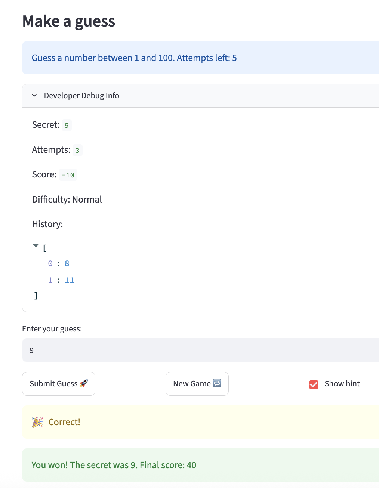

# 🎮 Game Glitch Investigator: The Impossible Guesser

## 🚨 The Situation

You asked an AI to build a simple "Number Guessing Game" using Streamlit.
It wrote the code, ran away, and now the game is unplayable. 

- You can't win.
- The hints lie to you.
- The secret number seems to have commitment issues.

## 🛠️ Setup

1. Install dependencies: `pip install -r requirements.txt`
2. Run the broken app: `python -m streamlit run app.py`

## 🕵️‍♂️ Your Mission

1. **Play the game.** Open the "Developer Debug Info" tab in the app to see the secret number. Try to win.
2. **Find the State Bug.** Why does the secret number change every time you click "Submit"? Ask ChatGPT: *"How do I keep a variable from resetting in Streamlit when I click a button?"*
3. **Fix the Logic.** The hints ("Higher/Lower") are wrong. Fix them.
4. **Refactor & Test.** - Move the logic into `logic_utils.py`.
   - Run `pytest` in your terminal.
   - Keep fixing until all tests pass!

## 📝 Document Your Experience

- Game Purpose: It’s a simple number-guessing game where you try to find a secret number picked by the app. It gives you hints after every try to help you narrow it down, and it tracks your score until you either win or run out of turns.

- Bugs Found: 
   The hints were completely backwards. It told me to go higher when I should have gone lower, and vice versa.

   The app was trying to compare text (the user's input) with a number (the secret guess), which caused a crash.

- Fixes Applied:
   I updated the game logic so the "Go HIGHER" and "Go LOWER" hints actually point you in the right direction.

   I added a step to convert the user's input into a number before comparing it, which fixed the crash and let the game run smoothly.

## 📸 Demo Walkthrough

Describe your fixed game in numbered steps so a reader can follow along without watching a video:

1. The game initializes and selects a secret number (e.g., 50).
2. The user enters a guess of 25.
3. The game correctly identifies the guess is too low and returns "Go HIGHER!"
4. The user enters a guess of 75.
5. The game correctly identifies the guess is too high and returns "Go LOWER!"
6. The user enters the correct number (50).
7. The game displays a success message, and the score updates to reflect the win.

**Screenshot** *(optional)*: <!-- Insert a screenshot of your fixed, winning game here -->



## 🧪 Test Results

```
# Paste your pytest output here, e.g.:
# pytest tests/
# ========================= X passed in 0.XXs =========================
```

## 🚀 Stretch Features

- [ ] [If you choose to complete Challenge 4, describe the Enhanced UI changes here — a screenshot is optional]
